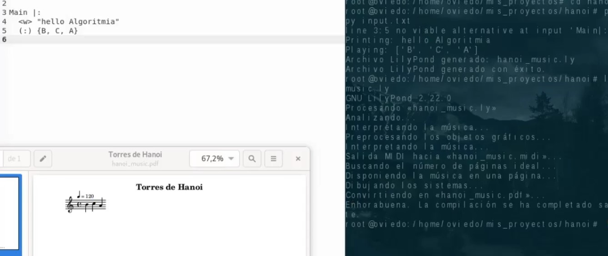

---

## 👩‍💻 Sobre mí

🎓 **Bachiller en Ingeniería Informática** por la Universidad Peruana Cayetano Heredia.

💻 Actualmente me desempeño como **Data Science Jr.**, trabajando en el análisis y procesamiento de información y en el desarrollo de soluciones basadas en datos.

🤖 Tengo experiencia académica y de investigación en **Machine Learning, Deep Learning, NLP, Large Language Models (LLM), RAG y sistemas de recomendación**, utilizando Python y herramientas del ecosistema de datos.

🔎 Me interesa especialmente aplicar la **Inteligencia Artificial y el análisis de datos a problemas reales**, combinando experimentación, evaluación de modelos y desarrollo de soluciones.

---

## 🛠️ Tecnologías

### Data Science & AI

  
  
  
  
  
  

### Frameworks & Libraries

  
  
  
  
  

### Data & Development

  
  
  
  

# 🚀 Proyectos destacados

<table>
<tr>

<td width="48%" valign="top" bgcolor="#161b22">

<h3>🧠 Clasificación automática de comentarios sobre la vacuna contra el VPH</h3>

Aplicación web para el análisis y clasificación automática de comentarios relacionados con la vacunación contra el Virus del Papiloma Humano mediante técnicas de <b>NLP y Machine Learning</b>.

<b>🛠️ Tecnologías</b> 
Python · NLP · Machine Learning · Web

</td>

<td width="48%" valign="top" bgcolor="#161b22">

 
 

<h3>
  🩺 Segmentación de imágenes de cáncer gastrointestinal</h3>

Desarrollo de un modelo de <b>segmentación semántica de imágenes médicas</b> utilizando Deep Learning y la arquitectura U-Net.

 

<b>🛠️ Tecnologías</b> 
Python · TensorFlow · U-Net · Computer Vision

</td>

</tr>
</table>

 

<table>
<tr>

<td width="48%" valign="top" bgcolor="#161b22">

<h3>⚡ Implementación de algoritmos de Machine Learning distribuidos</h3>

Implementación y evaluación de algoritmos de <b>Machine Learning en entornos paralelos y distribuidos</b>, comparando rendimiento y uso de recursos.

<b>🛠️ Tecnologías</b> 
Python · Dask · PySpark · Joblib · XGBoost

</td>

<td width="48%" valign="top" bgcolor="#161b22">

<h3>💻 Intérprete para el lenguaje Algoritmia</h3>

Desarrollo de un intérprete en <b>Python</b> para el lenguaje Algoritmia utilizando ANTLR4 para la definición de la gramática y el procesamiento sintáctico.

<b>🛠️ Tecnologías</b> 
Python · ANTLR4 · LilyPond

</td>

</tr>
</table>

 

<table>
<tr>

<td width="48%" valign="top" bgcolor="#161b22">

<h3>🎵 Sistema de recomendación de canciones</h3>

Sistema de recomendación musical basado en <b>filtrado colaborativo</b>, utilizando similitud de coseno y técnicas de álgebra lineal para generar recomendaciones personalizadas.

<b>🛠️ Tecnologías</b> 
Python · Machine Learning · SVD · PCA · Recommender Systems

</td>

</tr>
</table>

---

### ⚙️ &nbsp;GitHub Analytics

  

  

  

---

# 📫 Contacto

  
  

---

  <i>“Turning data into knowledge and ideas into intelligent solutions.”</i>

